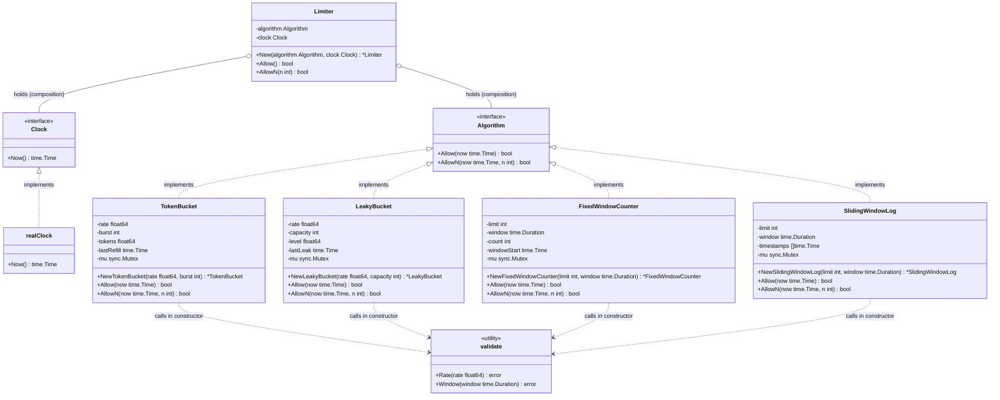
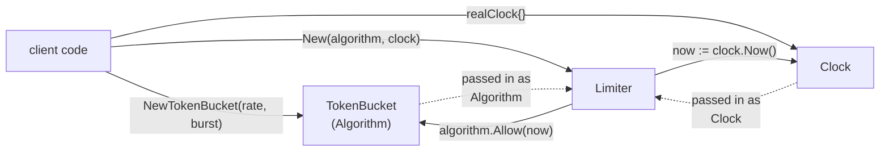

# Architecture

The library is built around the **Strategy** pattern: `Limiter` does
not know how the limit is actually computed — it delegates that work
to the `Algorithm` interface. A concrete algorithm (token bucket,
leaky bucket, fixed window, sliding window log, etc.) is passed into
the limiter from the outside, via the `New` constructor. This makes
it possible to add new algorithms without changing `Limiter`, and to
swap the algorithm for a mock implementing `Algorithm` in tests.

`Limiter` also owns the `Clock` used to read the current time. It
reads `now` once per call and passes it explicitly into the
algorithm's methods, so every `Algorithm` implementation is a pure
function of `now` — it never reads the wall clock itself.

## Shared infrastructure

The concrete algorithms don't share configuration parameters (each
one interprets "rate" in its own shape — `rate+burst` vs
`limit+window`), but two things are shared across the whole design:

- **`Clock`** — a small interface (`Now() time.Time`). Unlike
  `rate`/`limit`/`window`, "current time" means exactly the same
  thing for every algorithm, so it doesn't belong to any specific
  algorithm — it's a required parameter of `Limiter`'s constructor
  (`New(algorithm, clock)`), not of each algorithm's constructor.
  `Limiter` reads `clock.Now()` once per call and passes it down as
  an explicit `now` argument to `Allow`/`AllowN`. Because time
  arrives as a plain argument, every algorithm is trivial to
  unit-test on its own — just call `Allow(fixedTime)`, no fake clock
  or mock needed. In production code the caller passes the library's
  `realClock`; there is no implicit default.
- **`validate`** — a small set of package-level helper functions
  (`validate.Rate`, `validate.Window`, ...) that each algorithm's
  constructor calls to reject invalid input (`rate <= 0`,
  `window <= 0`, etc.). This avoids duplicating the same validation
  logic in every constructor without coupling the algorithms to each
  other or to `Limiter`.

`Limiter` still knows nothing about `rate`, `window`, or any other
algorithm-specific parameter — those stay owned by the concrete
algorithm.

## Usage flow

The client picks and creates a concrete algorithm implementation,
then passes it — together with a `Clock` — into `Limiter` via `New`.
From that point on, the client only calls `Limiter.Allow()`;
`Limiter` reads the current time itself and forwards it into the
algorithm.

## Extending with a new algorithm

To add a new rate-limiting algorithm:

1. Create a struct holding its own internal state (counters,
   timestamps, a mutex for concurrent access). It does not need a
   `Clock` field — time is received per call, not stored.
2. Implement `Allow(now time.Time) bool` and
   `AllowN(now time.Time, n int) bool` on it, satisfying the
   `Algorithm` interface.
3. Validate its constructor arguments using the shared `validate`
   helpers.
4. Pass an instance of the new struct, together with a `Clock`
   (typically `realClock`), into `ratelimit.New(algorithm, clock)`.

`Limiter` and the rest of the library remain unchanged.
