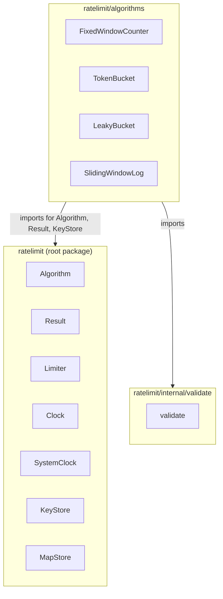
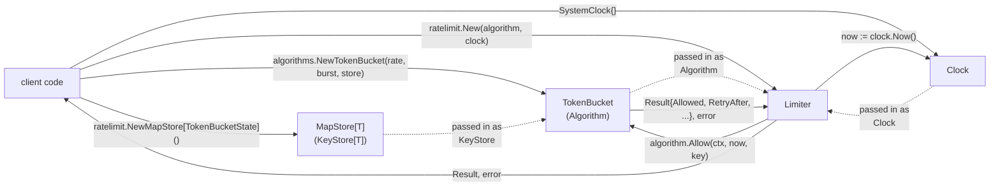

# Architecture

The library is built around the **Strategy** pattern: `Limiter` does
not know how the limit is actually computed — it delegates that work
to the `Algorithm` interface. A concrete algorithm (token bucket,
leaky bucket, fixed window, sliding window log, etc.) is passed into
the limiter from the outside, via the `New` constructor. This makes
it possible to add new algorithms without changing `Limiter`, and to
swap the algorithm for a mock implementing `Algorithm` in tests.

`Limiter` also owns the `Clock` used to read the current time. It
reads `now` once per call and passes it, together with the caller's
`ctx` and `key`, explicitly into the algorithm's methods, so every
`Algorithm` implementation is a pure function of `(ctx, now, key)` —
it never reads the wall clock itself, and never keeps a single shared
counter for every caller. `key` identifies whoever is being limited
(a user ID, an API key, an IP address, ...); each key's quota is
tracked independently of every other key's. `ctx` exists to carry
cancellation/timeouts through to a `KeyStore` that may do network
I/O (see below) — the in-memory default never uses it.

`Allow`/`AllowN` return `(Result, error)` rather than a plain `bool`.
A bare boolean can't tell a caller how long to wait before retrying or
how much quota is left, which is what a production caller (an HTTP
handler returning `429` with a `Retry-After` header, a client doing
backoff) actually needs. `Result` carries `Allowed` plus the detail
each concrete algorithm can compute from its own state: `Remaining`,
`RetryAfter`, `ResetAt`, and `Limit`. `error` is a separate axis
entirely: it's non-nil only when the algorithm couldn't reach a
decision at all (its `KeyStore` failed), never for an ordinary
"not allowed" outcome — that's always `Result{Allowed: false, ...}`
with a nil error. Callers must not conflate the two: whether to fail
open or closed when `error != nil` is a policy decision the algorithm
deliberately leaves to the caller.

```mermaid
classDiagram
    class Algorithm {
        <<interface>>
        +Allow(ctx Context, now time.Time, key string) (Result, error)
        +AllowN(ctx Context, now time.Time, key string, n int) (Result, error)
    }

    class Result {
        +Allowed bool
        +Remaining int
        +RetryAfter time.Duration
        +ResetAt time.Time
        +Limit int
    }

    class Limiter {
        -algorithm Algorithm
        -clock Clock
        +New(algorithm Algorithm, clock Clock) *Limiter
        +Allow(ctx Context, key string) (Result, error)
        +AllowN(ctx Context, key string, n int) (Result, error)
    }

    class Clock {
        <<interface>>
        +Now() time.Time
    }

    class SystemClock {
        +Now() time.Time
    }

    class KeyStore~T~ {
        <<interface>>
        +Update(ctx Context, key string, fn UpdateFunc~T~) (Result, error)
        +Delete(ctx Context, key string) error
    }

    class UpdateFunc~T~ {
        <<function>>
        +func(prev T, ok bool) (next T, out Result, err error)
    }

    class MapStore~T~ {
        -seed maphash.Seed
        -shards []mapShard~T~
        +NewMapStore~T~() *MapStore~T~
        +Update(ctx Context, key string, fn UpdateFunc~T~) (Result, error)
        +Delete(ctx Context, key string) error
    }

    class mapShard~T~ {
        -mu sync.Mutex
        -items map[string]T
    }

    class validate {
        <<utility>>
        +Rate(rate float64) error
        +Window(window time.Duration) error
    }

    class TokenBucket {
        -rate float64
        -burst int
        -store KeyStore~TokenBucketState~
        +NewTokenBucket(rate float64, burst int, store KeyStore~TokenBucketState~) *TokenBucket
        +Allow(ctx Context, now time.Time, key string) (Result, error)
        +AllowN(ctx Context, now time.Time, key string, n int) (Result, error)
    }

    class LeakyBucket {
        -rate float64
        -capacity int
        -store KeyStore~LeakyBucketState~
        +NewLeakyBucket(rate float64, capacity int, store KeyStore~LeakyBucketState~) *LeakyBucket
        +Allow(ctx Context, now time.Time, key string) (Result, error)
        +AllowN(ctx Context, now time.Time, key string, n int) (Result, error)
    }

    class FixedWindowCounter {
        -limit int
        -window time.Duration
        -store KeyStore~FixedWindowState~
        +NewFixedWindowCounter(limit int, window time.Duration, store KeyStore~FixedWindowState~) *FixedWindowCounter
        +Allow(ctx Context, now time.Time, key string) (Result, error)
        +AllowN(ctx Context, now time.Time, key string, n int) (Result, error)
    }

    class SlidingWindowLog {
        -limit int
        -window time.Duration
        -store KeyStore~SlidingWindowState~
        +NewSlidingWindowLog(limit int, window time.Duration, store KeyStore~SlidingWindowState~) *SlidingWindowLog
        +Allow(ctx Context, now time.Time, key string) (Result, error)
        +AllowN(ctx Context, now time.Time, key string, n int) (Result, error)
    }

    Limiter o-- Algorithm : holds (composition)
    Algorithm ..> Result : returns
    Limiter o-- Clock : holds (composition)
    Algorithm <|.. TokenBucket : implements
    Algorithm <|.. LeakyBucket : implements
    Algorithm <|.. FixedWindowCounter : implements
    Algorithm <|.. SlidingWindowLog : implements

    Clock <|.. SystemClock : implements
    KeyStore <|.. MapStore : implements

    TokenBucket o-- KeyStore : holds (injected)
    LeakyBucket o-- KeyStore : holds (injected)
    FixedWindowCounter o-- KeyStore : holds (injected)
    SlidingWindowLog o-- KeyStore : holds (injected)

    TokenBucket ..> validate : calls in constructor
    LeakyBucket ..> validate : calls in constructor
    FixedWindowCounter ..> validate : calls in constructor
    SlidingWindowLog ..> validate : calls in constructor
```

## Shared infrastructure

The concrete algorithms don't share configuration parameters (each
one interprets "rate" in its own shape — `rate+burst` vs
`limit+window`), but two things are shared across the whole design:

- **`Clock`** — a small interface (`Now() time.Time`). Unlike
  `rate`/`limit`/`window`, "current time" means exactly the same
  thing for every algorithm, so it doesn't belong to any specific
  algorithm — it's a required parameter of `Limiter`'s constructor
  (`New(algorithm, clock)`), not of each algorithm's constructor.
  `Limiter` reads `clock.Now()` once per call and passes it down as
  an explicit `now` argument to `Allow`/`AllowN`. Because time
  arrives as a plain argument, every algorithm is trivial to
  unit-test on its own — just call `Allow(ctx, fixedTime, key)`, no
  fake clock or mock needed. In production code the caller passes the
  library's `SystemClock`; there is no implicit default.
- **`validate`** — a small set of package-level helper functions
  (`validate.Rate`, `validate.Window`, ...) that each algorithm's
  constructor calls to reject invalid input (`rate <= 0`,
  `window <= 0`, etc.). This avoids duplicating the same validation
  logic in every constructor without coupling the algorithms to each
  other or to `Limiter`.
- **`KeyStore[T]`** — where a concrete algorithm keeps its per-key
  state (`Update`/`Delete`, keyed by a plain `string`). Each
  algorithm owns the *shape* of its own state (`FixedWindowCounter`
  needs `{count, windowStart}`, `SlidingWindowLog` needs
  `[]time.Time`, ...) and the store is parameterized on it, so the
  state is stored as its own type rather than as an `any`. A
  `KeyStore[T]` is passed into an algorithm's constructor
  (`NewFixedWindowCounter(limit, window, store)`), not owned by
  `Limiter` — only the algorithm knows the shape of the state it
  needs, so `Limiter` stays algorithm-agnostic and never has to know
  about keys or stores at all.

  Design choices worth calling out:
  - The *key* is a plain `string`, even though the *value* is a type
    parameter. A caller with a `uuid.UUID`, an `int`, or any other
    identifier serializes it to a string themselves (`id.String()`,
    `strconv.Itoa(n)`, ...) before calling `Allow`/`AllowN`. This keeps
    `Algorithm` and `Limiter` free of type parameters entirely, and
    avoids picking a key constraint that would work for an in-memory
    map but not for a future backend (Redis, ...) whose keys are
    strings anyway.
  - The *value* is a type parameter, `T`, rather than an `any`. Two
    reasons, one per axis. Correctness: handing one algorithm's store
    to another is now a compile error, where before the receiving
    algorithm's type assertion would quietly fail and read the key as
    having no state — silently resetting its quota at run time.
    Cost: an `any` heap-allocates every state larger than a word on
    every single write, so the old design burned one allocation per
    request purely on boxing.
  - Each algorithm's state type is *exported* (`FixedWindowState`,
    `SlidingWindowState`, ...) but its fields are not. The name has to
    be reachable so a caller can instantiate the store that holds it
    (`ratelimit.NewMapStore[algorithms.FixedWindowState]()`); the
    fields stay private so the state remains the algorithm's own
    business, and its zero value means "key not seen yet".
  - Every `KeyStore` method takes a `context.Context` and returns
    an `error`, even though `MapStore` ignores the former and never
    produces the latter. Go has no `async`/`await`: a network-backed
    implementation (Redis, ...) is written as an ordinary blocking
    call, but it can hang without a deadline and it can fail — a
    dropped connection, a timeout — in a way an in-memory map never
    can. `ctx` is how a caller bounds or cancels that call; `error` is
    how the store reports that it couldn't say what a key's state
    is, as opposed to reporting the key's state honestly (`ok=false`
    means "no state yet", not "don't know"). `Algorithm.Allow`/
    `AllowN` and `Limiter.Allow`/`AllowN` propagate both for the same
    reason — a rate-limiting decision that silently treated "Redis
    timed out" as "key has no state" would reset every caller's quota
    on every store blip.
  - Read-modify-write is **one** store operation, `Update`, not a
    `Get` followed by a `Set`. Reading a key's state, deciding, and
    writing the result has to be atomic, or two concurrent calls for
    one key lose an update. With `Get`/`Set` the only place to enforce
    that is *outside* the store, which in practice meant one
    `sync.Mutex` per algorithm instance covering every key — correct,
    but it serialized keys that never touch each other, and for a
    network-backed store it held that lock across the round trip,
    reducing the whole instance to one in-flight request at a time.
    Worse, across two processes sharing one Redis it wasn't even
    correct: each process guards only its own gap.
    Folding it into `Update` lets each store make it atomic its own
    way — `MapStore` takes a single shard lock, a Redis store would
    use a script or an optimistic retry — and **no algorithm holds a
    lock of its own any more.**
  - `MapStore` spreads keys over independently locked shards rather
    than guarding one map with one mutex, so calls for different keys
    normally proceed in parallel. The shard count is a power of two,
    which makes shard selection a mask over the key's hash; each
    shard is padded to its own cache line so that locking one shard
    doesn't invalidate a neighbour's.
  - `UpdateFunc` returns the `Result` instead of assigning it to a
    captured variable, and `Update` passes it back. This looks like a
    detail and is not: a `Result` captured by a closure escapes to
    the heap on every call. The one allocation that remains per
    request is the closure itself, which is unavoidable while
    `KeyStore` is an interface — the price of being able to swap in a
    distributed backend.
  - An `UpdateFunc` runs while the store holds the lock or
    transaction guarding the key, so it must not block: no I/O, no
    reentrant store calls. A network-backed store may also retry it
    on conflict, so it must be a pure function of its arguments.
  - There is no key eviction yet — a key, once seen, keeps its entry
    in the store forever. Fine for now (the library has no users
    yet), but a longer-lived process with a growing set of keys will
    need a TTL/eviction policy before this goes into production use.

`Limiter` still knows nothing about `rate`, `window`, `key`, or any
other algorithm-specific parameter — those stay owned by the concrete
algorithm.

## Package layout

Concrete algorithms live in their own package, `algorithms`, separate
from the root `ratelimit` package that defines `Algorithm`, `Result`,
`Limiter`, and `Clock`:

`algorithms` imports `ratelimit` to implement `Algorithm` and return
`Result`; `ratelimit` never imports `algorithms` back, so there's no
import cycle — this is the same shape as `image` and `image/png` in
the standard library, or `hash` and `crypto/sha256`. It also keeps
the Strategy pattern honest: `Limiter` depends only on the
`Algorithm` interface, never on a concrete type, so nothing stops a
caller from implementing `Algorithm` outside this module entirely.

`internal/validate` stays a separate, unexported package rather than
living inside `algorithms`, since it's shared infrastructure that any
future algorithm package — inside or outside `algorithms` — should be
able to call without depending on unrelated algorithm code.

## Usage flow

The client picks and creates a concrete algorithm implementation
(passing it a `KeyStore[T]` for that algorithm's own state type,
typically `ratelimit.NewMapStore[algorithms.FixedWindowState]()`),
then passes the algorithm — together with a `Clock` — into `Limiter`
via `New`. From that point on, the client calls
`Limiter.Allow(ctx, key)` with a `context.Context` (for cancellation,
should the store go over the network) and whatever identifies the
caller being limited (a user ID, an API key, ...); `Limiter` reads the
current time itself, forwards `ctx`, `now`, and the key into the
algorithm, and returns the `Result` the algorithm computed for that
key, or an `error` if the algorithm's `KeyStore` failed.

## Extending with a new algorithm

To add a new rate-limiting algorithm:

1. Define a state type for whatever one key needs to remember between
   calls (a struct of counters/timestamps, a slice, ...). Export the
   type name but keep its fields unexported, and make its zero value
   mean "key not seen yet". Then define a struct for the algorithm
   itself holding its config (`limit`, `window`, ...) and a
   `ratelimit.KeyStore[YourState]`. It does **not** need a mutex —
   atomicity is the store's job — it does not need a `Clock` field
   (time is received per call), and it does not store per-key state
   as its own fields; that lives in the store, addressed by key.
2. Implement `Allow(ctx context.Context, now time.Time, key string)
   (ratelimit.Result, error)` and `AllowN(ctx context.Context, now
   time.Time, key string, n int) (ratelimit.Result, error)`,
   satisfying the `ratelimit.Algorithm` interface. `AllowN` should be
   a single `store.Update` call whose `UpdateFunc` computes the next
   state and the `Result` together and returns both; `Allow` is
   `AllowN(..., 1)`. Return the state even when denying the request,
   since it may still have changed (a window rolling over, entries
   aging out). Fill in whichever `Result` fields the algorithm can
   meaningfully compute (at least `Allowed`; typically `RetryAfter`
   and `Remaining` too).

   Inside the `UpdateFunc`: use the `ok` argument if "no state yet"
   differs from your zero value (a token bucket starts a new key at
   full burst, not at zero tokens); do no I/O and take no locks, and
   assume it may be called more than once for one `Update` if the
   store retries.
3. Validate its constructor arguments using the shared
   `internal/validate` helpers.
4. Have the constructor accept a `ratelimit.KeyStore[YourState]`
   parameter (the caller decides the backend —
   `ratelimit.NewMapStore[YourState]()` for in-memory, or a custom
   implementation for something distributed). Pass an instance of the
   new struct, together with a `Clock` (typically
   `ratelimit.SystemClock`), into `ratelimit.New(algorithm, clock)`.

`Limiter` and the rest of the root package remain unchanged — they
know nothing about keys or stores beyond the `Algorithm` and
`KeyStore` interfaces themselves.
